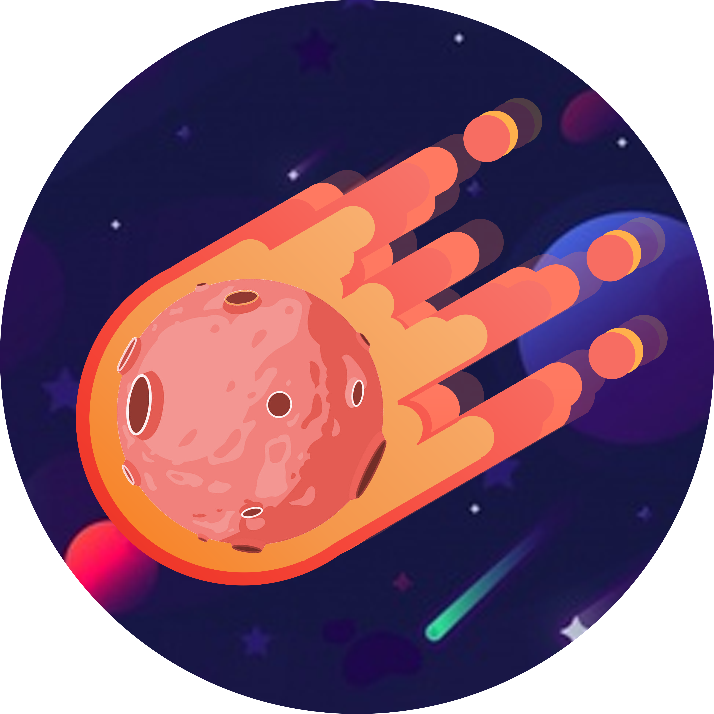

# Leet Code

> 화이팅

  

<h3> NoMoreBuild </h3>

Front-end Engineer @스타트업

## 목표

Leetcode의 알고리즘 문제를 가능하면 Sexy(?)하게 풀어보기

## 코드 목록

|  #   | 시도 날짜  |              문제 이름              |                         난이도                         |            링크            |
| :--: | :--------: | :---------------------------------: | :----------------------------------------------------: | :------------------------: |
|  1   | 2021-05-24 |               Two Sum               |       |  [:link:](problems/1.js)   |
|  26  | 2021-05-25 | Remove Duplicates from Sorted Array |       |  [:link:](problems/26.js)  |
|  28  | 2021-05-31 |         Implement strStr()          |       |  [:link:](problems/28.js)  |
| 136  | 2021-06-04 |            Single Number            |       | [:link:](problems/136.js)  |
| 151  | 2021-06-11 |      Reverse Words in a String      |  | [:link:](problems/151.js)  |
| 1672 | 2021-06-01 |       Richest Customer Wealth       |       | [:link:](problems/1672.js) |

Written by <a href="https://github.com/nomorebuild">@NoMoreBuild</a><small>💥</small>

